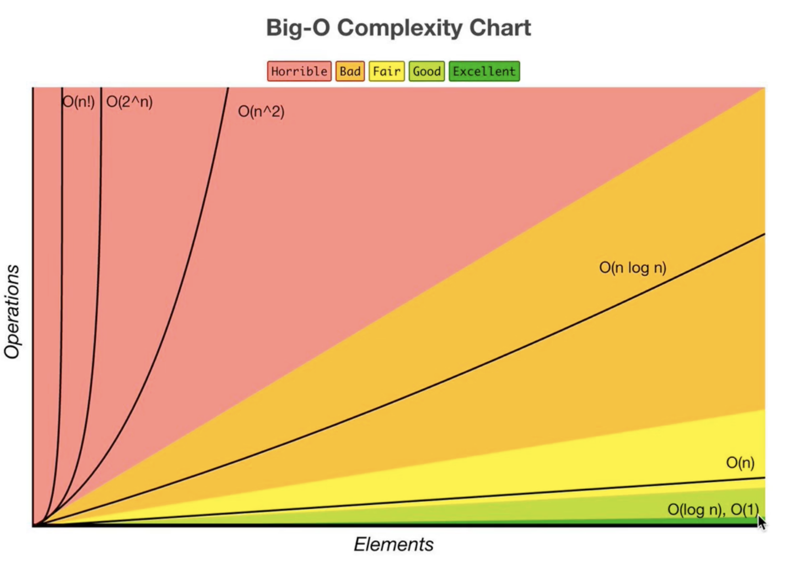

### Data Structures and Algorithms
Data - collection of values
Algorithms - steps that can be taken to manipulate data

#### How computers store data
- CPU: processes data
- RAM: storage (not persistent)
- Storage: persistent

#### Data structure types
- Arrays
- Stacks
- Queues
- Linked Lists
- Trees
- Tries
- Graphs
- Hash Tables

##### Arrays
- Static size
- Ordered collection of elements
- Access by index
###### Array methods
```
- push(item): adds the specified item to the end of the array
- pop( ): removes the last item from the end of the array // O(1)
- unshift(item): adds new item to the beginning of the array // O(n)
- splice(index, number_of_items_to_delete, item_to_insert): adds new item to the beginning of the array // O(n)
```
##### Stacks
- Last In First Out (LIFO)
- Limited access
- Often used for undo/redo functionality in applications
##### Queues
- First In First Out (FIFO)
- Limited access
- Used for tasks such as job scheduling or request handling
##### Linked Lists
- Dynamic size
- Unordered collections of nodes
- Nodes contain a value and reference to next node
##### Trees
- Hierarchical data structures
- Parent-child relationships
- Binary trees are common type with left & right children
##### Tries
- Efficient search tree where keys are strings
- Each node contains part of the key
##### Graphs
- Collection of vertices connected by edges
- Directed vs Undirected graphs
- Weighted vs. unweighted graphs
##### Hash Tables
- Key-value pairs stored in an array
- Fast lookup, insertion, deletion times
- Collision resolution methods include chaining, open addressing, etc.

#### Algorithm types
- Sorting
- Dynamic programming
- BFS + DFS (Searching)
- Recursion

#### Big O Notation
This is used to measure how long an algorithm takes to run. Big O measures how efficient a code is (how many operations it has to run) when the number of inputs increase.
<br />

<br />
Given the function:
```
  const nemo = ['nemo'];
  // assuming we had a bigger array
  const myArr = new Array(10000000);
  myArr.fill('jameson');
  myArr.push('nemo');

  const findNemo = (arr) => {
    const t1 = performance.now();
    for (let i = 0; i < arr.length; i++) {
      if(arr[i] === 'nemo') {
        console.log('Found nemo!');
      }
    }
    const t2 = performance.now();
    console.log(`Execution time: ${t2 - t1}`);
  }
  findNemo(nemo);
  findNemo(myArr);
```
The function above has a big O notation of O(n) (also known as linear time) because the number of operations increase as the the input increases.
In the case where the number if operations remains the same no matter how much the input increases, the algorithm has a big O notation of 1 - O(1), also known as constant time. For example:
```
  const firstBox = (arr) => {
    return arr[0];
  }
  const boxes = new Array(1000);
  boxes.fill('box');
  firstBox(boxes); // O(1)

  const firstTwoBoxes = (arr) => {
    console.log(arr[0]);
    console.log(arr[1]);
  }
```
In the first function above, the algorithm performs exactly one operation no matter nhow large the input gets. Similarly in the second function, the algorithm performs exactly two operation no matter the number of inputs. These kind of algorithms where the number of operations is constant no matter the number of inputs are generally classified with the O(1) - Constant Time big O notation.

Good code is measured by two major paramters:
- Readability
- Scalability

##### Calculating Big O
The following rules apply when calculating the Big O for an algorithm
- Consider the worst case scenario
- Ignore constants -> (2n + 100) is the same as O(n).
- Different terms for inputs
For example:
```
  const loopThroughBoxes = (boxes1, boxes2) => {
    boxes1.forEach(box => console.log(box));
    boxes2.forEach(box => console.log(box));
  }
```
In this function we are looping through each box twice, so it's O(2n), which simplifies to O(n). However, the assumption here is that ```boxes1``` and ```boxes2``` are not the same. Hence the Big O for this algorithm would be (a + b).
Now, assuming that the loops are embedded
```
  const alphabetsArray = ['a', 'b', 'c', 'd', 'e', 'f'];
  const logAllPairs = (arr) => {
    for (let i = 0; i < arr.length; i++) {
      for (let j = 0; j < arr.length; j++) {
        console.log([arr[i], arr[j]]);
      }
    }
  }
```
This algorithm has a Big O of O(n * n) = O(n^2), also known as Quadratic Time.
- Drop Non Dominants
Consider the following example:
```
const printNumbersAndSums = (numbers) => {
  numbers.forEach((num) => console.log(num + 1));
	
	numbers.forEach(num1 => {
		numbers.forEach(num2 => console.log(`${num1} + ${num2} = ${num1 + num2}`));
	});
}
printNumbersAndSums([1, 3, 5, 7, 9, 11, 15, 30]);
```
This algorithm has a Big O notation of O(n + n^2) which considering the dominant side leaves us with O(n^2);

##### Writing Good Code
A good codebase is determined by the following:
- Readability
- Memory (space complexity)
- Speed (time complexity)

#### Arrays
- array.push(item) // O(1)
- array.pop( ) // O(1)
- array.unshift(item) // O(n) - this is because it iterates over the entire array to shift the indices after inserting a new array
- array.splice(index, delete count, item) // O(n) - the advantage here is that the iteration starts at the defined index, not necessarily at the beginning. This completes the algorithm in shorter time.

There are two types of arrays, static and dynamic arrays:
Static arrays have a fixed length (the size is determined ahead of time and the memory allocated).
Dynamic arrays have memory allocated to them as they grow in size
When should you use arrays?
Arrays are great for fast lookups / push / pop
Cons: arrays have slow inserts and deletes

#### Hash Tables
Objects in JS are a type of hash tables
Hash function: a function that generates an output of fixed length for each input it gets. E.g., an MD5 hash generator.
A hash function is one way, one can't use the output to get the input.
Insert, lookup, delete and search algorithms in a hash table have a time complexity O(1).
##### Maps and Sets - other types of hash tables
- maps lets you use any data type as the key
- maps maintain insertion order
- sets only store keys, no values
 